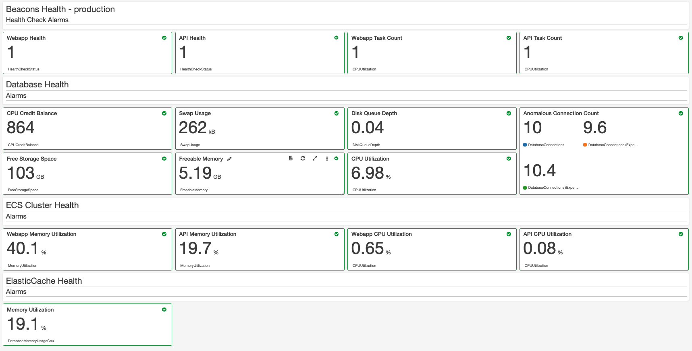

# Dashboard



## Prototype the dashboard

A CloudWatch Dashboard is described by a large JSON data structure and the easiest way to build one is to protoype it within the AWS console.

From the [Dashboards](https://eu-west-2.console.aws.amazon.com/cloudwatch/home?region=eu-west-2#dashboards:) section in the AWS console create a new dashboard (any name you wish) and start using the UI to build widgets and sections. Once you have the dashboard as you want it then view/edit the source to access the JSON.

## Terraform the dashboard

Take the JSON from the prototype and copy it into the Terraform but replace the hard coded ARN's with those generated by your terraform build code as per the example below.

```
resource "aws_cloudwatch_dashboard" "service_health" {
  dashboard_name = "${terraform.workspace}-myservice-dashboard"

  dashboard_body = <<-EOT
{
    "widgets": [
        {
            "height": 2,
            "width": 24,
            "y": 0,
            "x": 0,
            "type": "text",
            "properties": {
                "markdown": "# Service Health - ${terraform.workspace}\n## Health Check Alarms"
            }
        },
        {
            "height": 3,
            "width": 6,
            "y": 2,
            "x": 0,
            "type": "metric",
            "properties": {
                "title": "Webapp Health",
                "annotations": {
                    "alarms": [
                        "${aws_cloudwatch_metric_alarm.webapp_health.arn}"
                    ]
                },
                "view": "singleValue",
                "stacked": false,
                "type": "chart"
            }
        }
    ]
}
EOT
}
