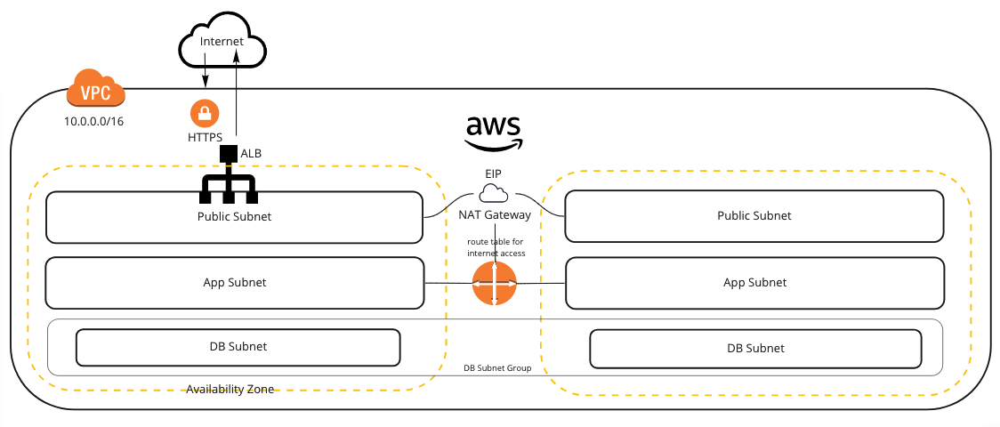

# Basic Networking Template



Using this template as a starting point you will create a single VPC and 3 subnets.

The *Public subnet* is where the load balancers are attached and anything that requires direct access to the internet.

The *App subnet* is where your applications can live but any internet access (in or out) is via a routing rule through the Public subnet.

The *DB subnet* can talk to the App subnet by default but has no internet access in or out by default.

*Availability zones* are configurable but typically 2 for production and 1 for other environments.

The ALB forces HTTPS by redirecting HTTP traffic to HTTPS.

:::caution

HTTPS is terminated at the ALB so traffic over the private network is not encrypted by default.
:::

:::info EIP

An EIP is always required for the NAT Gateway and is used as a static IP for outgoing traffic only.
:::

## Set the variables

The az_count variable is used to configure number of availability zones the subnets are split over.

```
variable "az_count" {
  type        = number
  description = "Number of AZs to cover in a given region"
  default     = 2
}

```

## VPC

```
resource "aws_vpc" "main" {
  cidr_block           = "10.0.0.0/16"
  enable_dns_hostnames = true
  enable_dns_support   = true
}
```

## Subnets

```
data "aws_availability_zones" "available" {
}

resource "aws_subnet" "public" {
  count                   = var.az_count
  vpc_id                  = aws_vpc.main.id
  cidr_block              = cidrsubnet(aws_vpc.main.cidr_block, 8, count.index)
  availability_zone       = data.aws_availability_zones.available.names[count.index]
  map_public_ip_on_launch = true
}

resource "aws_subnet" "app" {
  count             = var.az_count
  vpc_id            = aws_vpc.main.id
  cidr_block        = cidrsubnet(aws_vpc.main.cidr_block, 8, var.az_count + count.index)
  availability_zone = data.aws_availability_zones.available.names[count.index]
}

resource "aws_subnet" "db" {
  count             = var.az_count
  vpc_id            = aws_vpc.main.id
  cidr_block        = cidrsubnet(aws_vpc.main.cidr_block, 8, (2 * var.az_count) + count.index)
  availability_zone = data.aws_availability_zones.available.names[count.index]
}

resource "aws_db_subnet_group" "db" {
  subnet_ids = aws_subnet.db.*.id
}
```

## ALB

```
resource "aws_alb" "main" {
  name            = "${terraform.workspace}-myservice"
  subnets         = aws_subnet.public.*.id
  security_groups = [aws_security_group.lb.id]
}

resource "aws_alb_listener" "front_end" {
  load_balancer_arn = aws_alb.main.id
  port              = "80"
  protocol          = "HTTP"

  default_action {
    type = "redirect"

    redirect {
      port        = "443"
      protocol    = "HTTPS"
      status_code = "HTTP_301"
    }
  }
}

resource "aws_alb_listener" "front_end_ssl" {
  load_balancer_arn = aws_alb.main.arn
  port              = "443"
  protocol          = "HTTPS"
  ssl_policy        = "ELBSecurityPolicy-2016-08"
  certificate_arn   = "arn:aws:acm:eu-west-2:232705206979:certificate/b75eecc6-fff7-4114-b100-b1f0eb0641d7"

  default_action {
    target_group_arn = aws_alb_target_group.webapp.id
    type             = "forward"
  }
}

resource "aws_alb_target_group" "webapp" {
  name        = "${terraform.workspace}-webapp-target-group"
  port        = var.webapp_port
  protocol    = "HTTP"
  vpc_id      = aws_vpc.main.id
  target_type = "ip"

  health_check {
    healthy_threshold   = "3"
    interval            = "30"
    protocol            = "HTTP"
    matcher             = "200"
    timeout             = "3"
    path                = var.webapp_health_check_path
    unhealthy_threshold = "2"
  }

  lifecycle {
    create_before_destroy = true
  }
}
```

## Internet Gateway (routes incoming/outgoing traffic for your VPC)
```
resource "aws_internet_gateway" "gw" {
  vpc_id = aws_vpc.main.id
}

resource "aws_route" "internet_access" {
  route_table_id         = aws_vpc.main.main_route_table_id
  destination_cidr_block = "0.0.0.0/0"
  gateway_id             = aws_internet_gateway.gw.id
}
```
## NAT Internet Gateway (outgoing traffic)

```
resource "aws_eip" "gw" {
  count      = var.nat_gateway_count
  vpc        = true
  depends_on = [aws_internet_gateway.gw]
}

resource "aws_nat_gateway" "gw" {
  count         = var.nat_gateway_count
  subnet_id     = element(aws_subnet.public.*.id, count.index)
  allocation_id = element(aws_eip.gw.*.id, count.index)
}
```

## Routing

```
resource "aws_route_table" "private" {
  count  = var.nat_gateway_count
  vpc_id = aws_vpc.main.id

  route {
    cidr_block     = "0.0.0.0/0"
    nat_gateway_id = element(aws_nat_gateway.gw.*.id, count.index)
  }
}

resource "aws_route_table_association" "app" {
  route_table_id = element(aws_route_table.private.*.id, count.index)
  count          = var.az_count
  subnet_id      = element(aws_subnet.app.*.id, count.index)
}
```
