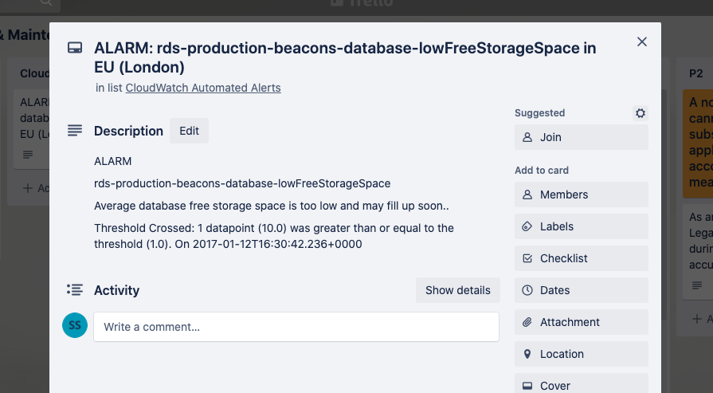

# Trello Notifications

Integrate your SNS notifications into Trello via a Lambda function.



## Terraform

The following Terraform creates a Lambda function and subscribes it to an SNS topic.

```
resource "aws_iam_role" "iam_for_lambda" {
  name = "${terraform.workspace}-iam_for_lambda"

  assume_role_policy = <<EOF
{
  "Version": "2012-10-17",
  "Statement": [
    {
      "Action": "sts:AssumeRole",
      "Principal": {
        "Service": "lambda.amazonaws.com"
      },
      "Effect": "Allow",
      "Sid": ""
    }
  ]
}
EOF
}

resource "aws_lambda_function" "notify_trello_lambda" {
  filename      = "trello-lambda/src/trello-lambda.zip"
  function_name = "${terraform.workspace}-notify-trello"
  role          = aws_iam_role.iam_for_lambda.arn
  handler       = "index.handler"

  source_code_hash = filebase64sha256("trello-lambda/src/trello-lambda.zip")

  runtime = "nodejs12.x"

  environment {
    variables = {
      trelloToken  = var.trello_token
      trelloApiKey = var.trello_api_key
      trelloListId = var.trello_list_id
    }
  }
}

resource "aws_lambda_permission" "with_sns_technical_alerts" {
  statement_id  = "AllowExecutionFromSNSTechnicalAlerts"
  action        = "lambda:InvokeFunction"
  function_name = aws_lambda_function.notify_trello_lambda.arn
  principal     = "sns.amazonaws.com"
  source_arn    = aws_sns_topic.sns_technical_alerts.arn
}

resource "aws_sns_topic_subscription" "sns_technical_alerts_lambda_subscription" {
  topic_arn = aws_sns_topic.sns_technical_alerts.arn
  protocol  = "lambda"
  endpoint  = aws_lambda_function.notify_trello_lambda.arn
}
```

## Lambda

The Lambda is delivered to AWS within a zip and can be edited, built and tested from the AWS console.

I've included an [example](https://github.com/struds/ops-cookbook/blob/main/example-code/trello-notifications/trello-lambda/trello-test-data.json) of a JSON CloudWatch Alert delivered via SNS which can be used as a test data within the AWS console.


However to develop the Lambda function i've included a self contained project with using the Jest test framework which mocks out the trello API allowing local development without deployment.

This [Node.js Lambda README](https://github.com/struds/ops-cookbook/blob/main/example-code/trello-notifications/trello-lambda/README.md) below has instructions on how to build and run the Lambda locally but also how to integrate with Trello and deploy into AWS.
