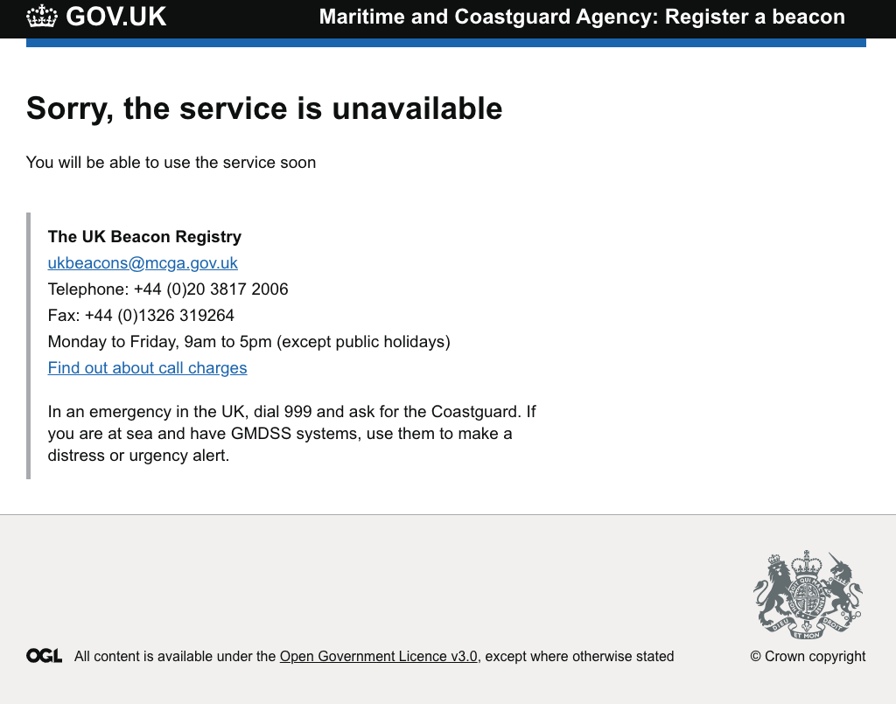

# Maintenance Page

A GitHub Actions deployable maintenace page with gov.uk branding and a configurable message.

## The Premise

We will deploy a stand alone static webpage into AWS S3 and served via CloudFront with HTTPS.

The Maintenance Page is enabled by updating the A record for the domain in Route53.

## Build and Run

[README](https://github.com/struds/ops-cookbook/blob/main/example-code/maintenance-page/README.md)

## Configure a certificate

You will need to manually create a certificate and reference the arn created from the terraform.

## Managing the Terraform

[S3](https://github.com/struds/ops-cookbook/blob/main/example-code/maintenance-page/s3.tf)

[Cloudfront](https://github.com/struds/ops-cookbook/blob/main/example-code/maintenance-page/cloudfront.tf)

## Deploying from GitHub

[GitHub Actions Workflow](https://github.com/struds/ops-cookbook/blob/main/example-code/maintenance-page/workflows/maintenance-page.yml)

